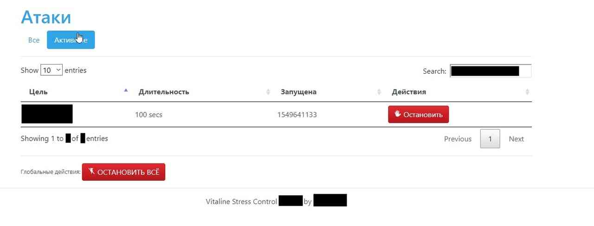

# Vitalina Stress Control
Free (as in freedom) to use and distribute stressing control solution.

Vitalina Stress Control was used on SpectStress during it's working period (2018-2019)

## Features
VSC is production-ready (well, it was at sometime at least and now it is still better than 60% of crap you'll find on forums: it is free and despite `mod_security` is recommended, VSC is totally XXS/SQLInjection proof, you can be totally be sure about the security aspect. And also the code is not very bad (look at the bottom))\
Complete list of features:
- [x] Olegian API Support (see MIGRATING-TO-OLEGIAN.md)
- [x] Built-in rate limiting, XSS protection, SQL Injection, CSRF protection
- [x] Built on top of `Nette`
- [x] Infinite amount of methods and servers are supported
- [x] Each method can have its own pricing tier and minimum plan
- [x] Flexible plans system and auto-payments supported (OpenNode/Robokassa)
- [x] Attacks can be stopped all together
- [x] Customizable layouts
- [x] Fake DStat :DDD
- [x] Site answer check with detailed log
- [x] Curl is not required
- [x] *VIP* Hub
- [x] Gravatar support
- [x] CaptchaEverywhere

## System requierements
+ A web-server (Apache 2 supported, but 2.4+ recommended, you can also use Tengine or Nginx or Caddy)
+ PHP7.2 or higher
+ `256MB` memory for PHP (`64MB` per script)
+ `300MB` disk space
+ MariaDB or Percona server (others **are not** supported)
### Installation requirements
+ Composer
### Optional software
These are required for certain features to work, but these features are unstable or non-important.
+ RabbitMQ (eventing for PSA)
+ openSUSE

# Installing
*Installation is not possible at the moment, sorry*

## Installing from Vagrant
*Installation is not possible at the moment, sorry*

# Status of this repository
Currently, this repository lacks up-to-date `composer.json` and has complete lack of `.htaccess` and `_init.sql` or any DB migrations at all. You may still try recovering it, pull requests are also very welcome.\
VSC will not recieve any other updates, except ones, that are going to fix **VERY CRITICAL** issues (for example, DB migrations).\
Status of statical analysis is here:
[ Show more details?](https://codescene.io/projects/4879/jobs/latest-successful/results)

# Original README.md:
> Vitalina Stress Control
Open-source stresser frontend. Free as in freedom.
